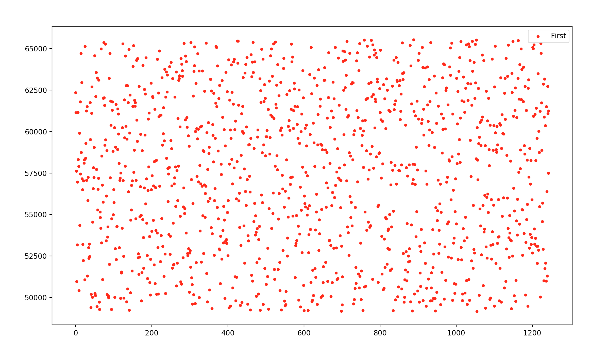

# p2p test for port guessing experiment

### 1.use tcpdump listen the udp packet of a server
 tcpdump -i eth0 udp and dst 104.194.206.222 and port 9989>/var/www/html/port.log

### 2.send many many packets to the server
 bash a.sh

### 3.download the log file
 wget http://xxxxx/port.log

### 4.use python to show the port 
 python3.7 p2p_test.py
 

